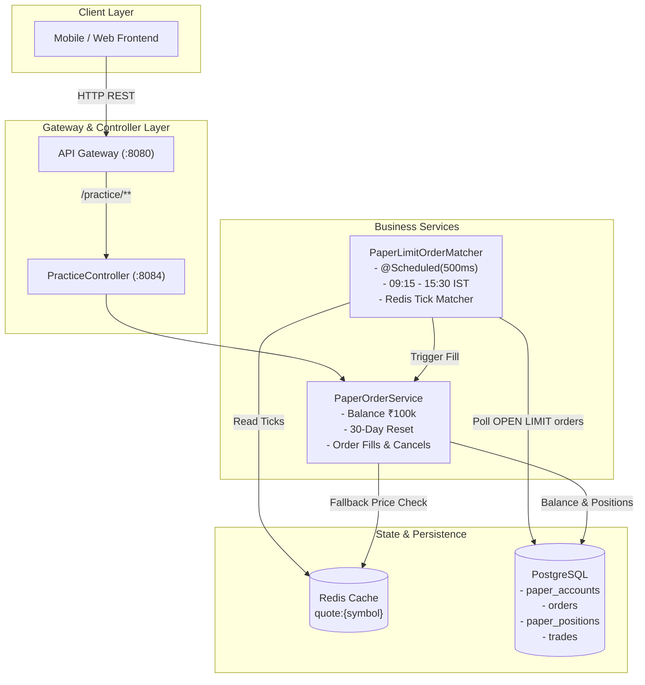

# Practice Trading System Specification & Technical Documentation

**Target Service:** `practice-service`  
**Base Path:** `/practice`  
**Status:** Implemented, Tested & Verified (46/46 Tests Passing)  
**Last Updated:** October 2026  

---

## 1. System Overview

The **Practice Trading System** provides risk-free paper trading capabilities for users to practice buying and selling Indian equities with simulated funds and real-time market data.

### Key Capabilities
1. **Virtual Capital Allocation:** Automatically provisions ₹100,000.00 INR virtual cash for every new user.
2. **30-Day Reset Rate Limit:** Allows users to reset their account back to the starting ₹100,000.00 balance, restricted to a strict 30-day cooldown period.
3. **Execution Modes:**
   - **Market Orders:** Immediate fills against live quotes (with fallback to catalog prices).
   - **Limit Orders:** Escrowed balance/shares with background matching when price criteria are met.
4. **Automated Matching Engine:** A 500ms background scheduler that evaluates open limit orders against real-time Redis price ticks during Indian stock market hours.
5. **Double-Spend & Overdraft Protection:** Enforces reservations on available balance (`balance - reservedBalance`) and available holdings (`quantity - reservedQuantity`).

---

## 2. Architecture & Data Flow



---

## 3. Database Schema & State Management

The practice system operates within the `practice` PostgreSQL schema across four primary tables:

### 3.1 `paper_accounts`
Stores the virtual wallet balance and cooldown metadata.
* `user_id` (`UUID`, PK): Unique user identifier.
* `balance` (`NUMERIC(14,2)`): Total cash balance (Defaults to ₹100,000.00).
* `reserved_balance` (`NUMERIC(14,2)`): Cash locked in pending Limit BUY orders.
* `last_reset_at` (`TIMESTAMPTZ`): Timestamp of account creation or last reset.
* `created_at` (`TIMESTAMPTZ`): Initial creation timestamp.

$$\text{Available Balance} = \text{balance} - \text{reserved\_balance}$$

### 3.2 `paper_positions`
Tracks stock shares owned by the user.
* `user_id` (`UUID`, PK composite): User identifier.
* `symbol` (`VARCHAR(30)`, PK composite): Stock ticker (e.g. `RELIANCE`, `TCS`, `INFY`).
* `quantity` (`INT`): Total shares owned.
* `reserved_quantity` (`INT`): Shares committed in pending Limit SELL orders.
* `updated_at` (`TIMESTAMPTZ`): Last modified timestamp.

$$\text{Available Quantity} = \text{quantity} - \text{reserved\_quantity}$$

### 3.3 `orders`
Audit trail and lifecycle state of every market and limit order.
* `id` (`UUID`, PK): Unique order identifier.
* `user_id` (`UUID`): Placing user.
* `client_order_id` (`VARCHAR(64)`): Unique idempotency key.
* `symbol` (`VARCHAR(30)`): Stock symbol.
* `side` (`VARCHAR(10)`): `BUY` or `SELL`.
* `order_type` (`VARCHAR(10)`): `MARKET` or `LIMIT`.
* `quantity` (`INT`): Order size.
* `filled_qty` (`INT`): Executed quantity.
* `price` (`NUMERIC(12,2)`): Limit price (or fill price for market orders).
* `avg_price` (`NUMERIC(12,4)`): Execution average price.
* `status` (`VARCHAR(20)`): `OPEN`, `COMPLETE`, or `CANCELLED`.
* `is_paper` (`BOOLEAN`): `true` for all practice orders.
* `placed_at` (`TIMESTAMPTZ`): Placed timestamp.

### 3.4 `trades`
Immutable execution receipts generated when an order is filled.
* `id` (`UUID`, PK): Trade identifier.
* `order_id` (`UUID`): Reference to parent order.
* `fill_price` (`NUMERIC(12,4)`): Price per share at execution.
* `fill_qty` (`INT`): Executed shares.
* `net_amount` (`NUMERIC(14,4)`): Total trade value (`fill_price * fill_qty`).
* `traded_at` (`TIMESTAMPTZ`): Execution time.

---

## 4. `PaperOrderService` Detailed Design

### 4.1 Account Lifecycle & 30-Day Reset Rule
* **Creation:** When a user first accesses practice trading, an account is auto-created with ₹100,000.00 cash and `lastResetAt = Instant.now()`.
* **Reset Cooldown:** Resets are governed by `RESET_COOLDOWN_DAYS = 30`.
* **Execution of `resetAccount(UUID userId)`:**
  1. Compares `now` against `account.getLastResetAt() + 30 days`.
  2. If `now < nextEligibleReset`, throws `ResponseStatusException(HttpStatus.BAD_REQUEST)` with the remaining days.
  3. If eligible (`now >= nextEligibleReset`):
     - All user orders with status `OPEN` are updated to `CANCELLED`.
     - All user positions in `paper_positions` have `quantity` and `reserved_quantity` reset to `0`.
     - Account `balance` is reset to `100000.00`.
     - Account `reserved_balance` is reset to `0.00`.
     - `lastResetAt` is updated to `Instant.now()`.

### 4.2 Order Placement & Execution Logic

#### Market BUY (`executeMarketBuy`)
1. Validates `quantity > 0`.
2. Resolves current price from Redis `quote:{symbol}`; falls back to `Stock.getPrice()` if Redis quote is not yet published.
3. Computes order cost: $\text{orderValue} = \text{marketPrice} \times \text{quantity}$.
4. Verifies `availableBalance >= orderValue`. Throws `IllegalArgumentException` if insufficient.
5. Deducts `orderValue` from `balance`.
6. Increases position `quantity` by `quantity`.
7. Saves Order with status `COMPLETE`, `filledQty = quantity`, `avgPrice = marketPrice`.
8. Records an immutable trade row in `trades`.

#### Market SELL (`executeMarketSell`)
1. Validates `quantity > 0`.
2. Resolves current market price.
3. Verifies `availableQuantity >= quantity`. Throws `IllegalArgumentException` if user attempts to sell shares committed in limit orders.
4. Decreases position `quantity` by `quantity`.
5. Adds proceeds ($\text{marketPrice} \times \text{quantity}$) to `balance`.
6. Saves Order with status `COMPLETE`, `filledQty = quantity`, `avgPrice = marketPrice`.
7. Records an immutable trade row in `trades`.

#### Limit BUY Placement (`placeLimitBuy`)
1. Validates `quantity > 0` and `limitPrice > 0`.
2. Computes escrow requirement: $\text{reservedAmount} = \text{limitPrice} \times \text{quantity}$.
3. Verifies `availableBalance >= reservedAmount`.
4. Increments `reserved_balance` by `reservedAmount` in `paper_accounts` (cash remains in `balance` until execution).
5. Creates Order with status `OPEN`, `filledQty = 0`, `price = limitPrice`.

#### Limit SELL Placement (`placeLimitSell`)
1. Validates `quantity > 0` and `limitPrice > 0`.
2. Verifies `availableQuantity >= quantity`.
3. Increments `reserved_quantity` by `quantity` in `paper_positions`.
4. Creates Order with status `OPEN`, `filledQty = 0`, `price = limitPrice`.

#### Limit Execution & Price Improvement
* **Limit BUY Fill (`executeLimitBuy`):**
  - Actual Cost = $\text{marketPrice} \times \text{quantity}$.
  - Reserved Escrow = $\text{limitPrice} \times \text{quantity}$.
  - `reserved_balance` is decremented by `reservedAmount`.
  - `balance` is decremented by `actualCost`.
  - **Price Improvement Benefit:** Because $\text{marketPrice} \le \text{limitPrice}$, the difference $(\text{limitPrice} - \text{marketPrice}) \times \text{quantity}$ automatically stays in user's available balance!
  - Position `quantity` is credited with purchased shares.
  - Order status is set to `COMPLETE`.
* **Limit SELL Fill (`executeLimitSell`):**
  - Position `reserved_quantity` is decremented by `quantity`.
  - Position `quantity` is decremented by `quantity`.
  - Total sale proceeds ($\text{marketPrice} \times \text{quantity}$) are credited to `balance`.
  - Order status is set to `COMPLETE`.

#### Order Cancellation (`cancelOrder`)
1. Verifies order exists, belongs to authenticated user, and is currently `OPEN`.
2. Marks order status as `CANCELLED`.
3. **For BUY Limit Orders:** Reduces `reserved_balance` by `order.price * order.quantity` (floored at 0).
4. **For SELL Limit Orders:** Reduces `reserved_quantity` by `order.quantity` (floored at 0).

---

## 5. `PaperLimitOrderMatcher` Scheduler Specification

### 5.1 Cadence & Schedule Constraints
* **Frequency:** 500 milliseconds (`@Scheduled(fixedRate = 500)`).
* **Market Zone:** `Asia/Kolkata`.
* **Trading Window:** `09:15:00` to `15:30:00` IST.
* **Operating Days:** Monday, Tuesday, Wednesday, Thursday, Friday.
* **Closed Windows:** Saturdays, Sundays, before 09:15 IST, and after 15:30 IST.

### 5.2 Matching Rules Matrix

| Order Type | Side | Limit Price | Market Price | Condition | Action Taken |
| :--- | :--- | :--- | :--- | :--- | :--- |
| **LIMIT** | `BUY` | ₹2,500.00 | ₹2,480.00 | $\text{marketPrice} \le \text{limitPrice}$ | **Executes Fill** (Price improvement) |
| **LIMIT** | `BUY` | ₹2,500.00 | ₹2,550.00 | $\text{marketPrice} > \text{limitPrice}$ | *No fill* (remains `OPEN`) |
| **LIMIT** | `SELL` | ₹3,500.00 | ₹3,520.00 | $\text{marketPrice} \ge \text{limitPrice}$ | **Executes Fill** |
| **LIMIT** | `SELL` | ₹3,500.00 | ₹3,480.00 | $\text{marketPrice} < \text{limitPrice}$ | *No fill* (remains `OPEN`) |
| **LIMIT** | Any | Any | `null` | No tick in Redis | *Skipped safely* |

### 5.3 Reliability & Concurrency
* **Pessimistic Locking:** `findByIsPaperTrueAndOrderTypeAndStatus("LIMIT", "OPEN")` applies `PESSIMISTIC_WRITE` locks during query to prevent double matching across distributed instances.
* **Error Isolation:** Each order execution is enclosed in an isolated `try-catch` block. A failure or data anomaly in one order is logged and will never abort the remaining orders in the matching tick.
* **Testable Clock:** Supports `java.time.Clock` dependency injection so automated unit tests can deterministically simulate any day, time, or market session.

---

## 6. REST API Reference

All endpoints are hosted on `practice-service` (default port `8084`, routed through Gateway at `:8080/practice/**`). Endpoints require a valid JWT Bearer Token.

### 6.1 Get Practice Account
* **Method:** `GET`
* **Path:** `/practice/account`
* **Response `200 OK`:**
  ```json
  {
    "balance": 100000.00,
    "reservedBalance": 24000.00,
    "positions": [
      {
        "symbol": "RELIANCE",
        "quantity": 10,
        "reservedQuantity": 0
      }
    ]
  }
  ```

### 6.2 Reset Practice Account
* **Method:** `POST`
* **Path:** `/practice/account/reset`
* **Response `200 OK` (Reset Granted):**
  ```json
  {
    "balance": 100000.00,
    "reservedBalance": 0.00,
    "positions": []
  }
  ```
* **Response `400 Bad Request` (Cooldown Active):**
  ```json
  {
    "status": 400,
    "error": "Bad Request",
    "message": "Account can only be reset once every 30 days. Days remaining: 21"
  }
  ```

### 6.3 Place Order
* **Method:** `POST`
* **Path:** `/practice/orders`
* **Request Body (Limit Order Example):**
  ```json
  {
    "symbol": "RELIANCE",
    "side": "BUY",
    "shares": 5,
    "orderType": "LIMIT",
    "price": 2450.00,
    "clientOrderId": "client-uuid-987"
  }
  ```
* **Response `201 Created`:**
  ```json
  {
    "orderId": "65b53026-9635-4b24-bc80-0a3746315fc0",
    "symbol": "RELIANCE",
    "side": "BUY",
    "shares": 5,
    "pricePerShare": 2450.00,
    "totalPaid": 12250.00,
    "orderType": "LIMIT",
    "status": "OPEN",
    "xpEarned": 25
  }
  ```

### 6.4 Cancel Order
* **Method:** `DELETE`
* **Path:** `/practice/orders/{orderId}`
* **Response:** `204 No Content`
* **Error Codes:**
  - `404 Not Found`: Order ID does not exist.
  - `403 Forbidden`: Order belongs to another user.
  - `400 Bad Request`: Order is not in `OPEN` status.

### 6.5 Get My Orders
* **Method:** `GET`
* **Path:** `/practice/orders`
* **Response `200 OK`:** Array of `OrderReceipt` objects sorted by placed timestamp descending.

---

## 7. Verification & Test Suite Summary

The service is validated with automated JUnit 5 test suites.

```
[INFO] Results:
[INFO] Tests run: 46, Failures: 0, Errors: 0, Skipped: 0
[INFO] BUILD SUCCESS
```

| Test Class | Test Count | Key Areas Verified |
| :--- | :---: | :--- |
| `PaperOrderServiceTest` | 20 | ₹100,000 balance default; Market Buy/Sell; Limit Buy/Sell; Overdraft checks; Reserved share locks; Price improvement calculations; Order cancellations; 30-day reset rate limiter (< 30 days blocked with 400, >= 30 days resets balance & clears holdings). |
| `PaperLimitOrderMatcherTest` | 10 | Weekday market hours (09:15–15:30 IST); Weekend and off-hours inactivity; Redis tick matching for BUY (`marketPrice <= limitPrice`) and SELL (`marketPrice >= limitPrice`); Null quote resilience; Error isolation across order ticks. |
| `PracticeControllerTest` | 7 | Controller routing, authentication context propagation, order creation validation, reset endpoint integration, cancellation endpoint. |
| `PriceAlertServiceTest` | 9 | Price alert condition matching (GT/LT), notification dispatching, expired alert handling. |

---

## 8. Source File Locations

* **Service Logic:**
  - [`PaperOrderService.java`](../practice-service/src/main/java/in/sapphirus/rupee/practice/service/PaperOrderService.java)
  - [`PaperLimitOrderMatcher.java`](../practice-service/src/main/java/in/sapphirus/rupee/practice/service/PaperLimitOrderMatcher.java)
  - [`PracticeController.java`](../practice-service/src/main/java/in/sapphirus/rupee/practice/api/PracticeController.java)
* **Unit & Integration Tests:**
  - [`PaperOrderServiceTest.java`](../practice-service/src/test/java/in/sapphirus/rupee/practice/service/PaperOrderServiceTest.java)
  - [`PaperLimitOrderMatcherTest.java`](../practice-service/src/test/java/in/sapphirus/rupee/practice/service/PaperLimitOrderMatcherTest.java)
  - [`PracticeControllerTest.java`](../practice-service/src/test/java/in/sapphirus/rupee/practice/api/PracticeControllerTest.java)
* **API Specifications & Postman:**
  - [`API_Contracts_And_Types.md`](API_Contracts_And_Types.md)
  - [`Rupee_API_Collection.postman_collection.json`](../postman/Rupee_API_Collection.postman_collection.json)
